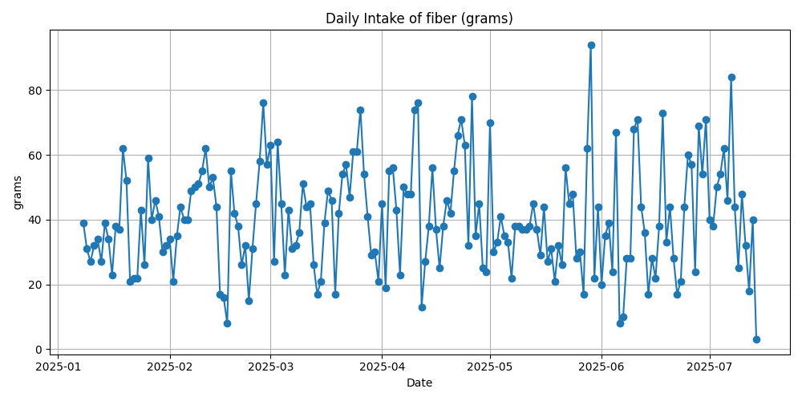

# MyFitnessPal Diary Parser & Nutrition Dashboard

## Overview
This project is a comprehensive dashboard for tracking and analyzing my nutritional data from January 1, 2025 to July 14, 2025. During this period, I have meticulously tracked every single food I've consumed. By parsing food diary PDFs exported from MyFitnessPal, merging with weight and fitness data, and visualizing key metrics, I can gain actionable insights into my dietary habits and identify potential nutritional deficiencies.

## Purpose
The main goal of this dashboard is to help you:
- Monitor daily intake of calories, macros, and nutrients.
- Track weight changes over time.
- Identify frequently consumed foods and their nutritional impact.
- Detect patterns and deficiencies in your diet for improved health and fitness outcomes.

## Techniques Used
- **PDF Parsing:** Extracts food diary entries from MyFitnessPal PDF exports using `pdfplumber` and robust regex logic to handle multi-line and edge-case entries.
- **Data Cleaning:** Cleans and merges food diary data with weight logs using `pandas`, ensuring all relevant rows are included and missing values are handled.
- **Visualization:** Uses `matplotlib` to create clear, informative charts for calories, macros, nutrients, and top foods.
- **Automation:** Scripts are modular and can be run independently for each visualization or data processing step.

## Folder Structure
- `pdf/` — Contains all original MyFitnessPal diary PDFs.
- `data/` — Contains all processed CSV files, including cleaned diary and merged weight data.
- `visualizations/` — Contains all generated PNG charts for easy review.

## Visualizations & Summaries

### 1. Weight Over Time

- I notice that my weight fluctuates, especially during periods when I eat more calories or change my macro balance. Most spikes in weight seem to follow cheat days where I eat more than usual. If my weight trends up or down outside my goals, I review my food choices for those days. When my weight is stable and healthy, I know I'm managing my diet well.

### 2. Daily Calorie Intake

- I see spikes in my calorie intake that usually line up with cheat days, weekends, or social events. When my calories are consistent and close to my goal, I feel best. If I notice long stretches of low calories, I check for signs of low energy. Too many high-calorie days can lead to weight gain, so I keep an eye on those.

### 3. Daily Macros

- Most days, my macros look balanced, but I see spikes in protein, carbs, and fat after cheat days or big meals. If I notice my fat intake is high for several days, I try to adjust my food choices. I aim for enough protein to support my activity level.


### 4. Daily Nutrients
#### Cholesterol

- Most days I'm under the recommended 300mg, but I see spikes that line up with cheat days or when I eat eggs or shellfish.

#### Sodium


- I often go over the 2300mg limit, especially after cheat days, processed foods, or restaurant meals. I know I should cut back to help my blood pressure.

#### Sugar

- My sugar intake is usually moderate, but it jumps after cheat days, desserts, or lots of fruit. If I see too many high-sugar days, I try to cut back for my health.

#### Fiber

- Some days I don't hit the 25g target, so I try to eat more whole grains, fruits, and veggies. More fiber helps my digestion and keeps me full.


### 5. Top Foods

- I see that lean proteins like chicken breast and protein powder, and staple carbs like rice and lentils, are my top foods. If I notice processed foods or sweets in the top 10, I try to eat them less often for better health.

## How to Use
1. Place your MyFitnessPal diary PDFs in the `pdf/` folder.
2. Run `mfp_cleaner.py` to parse and clean the data.
3. Run `mfp_add_weight.py` to merge weight logs.
4. Use the visualization scripts (`plot_weight_over_time.py`, `plot_daily_calories.py`, `plot_daily_macros.py`, `plot_top_foods.py`) to generate charts in the `visualizations/` folder.

## Requirements
- Python 3.x
- `pdfplumber`, `pandas`, `matplotlib`

Install dependencies:
```bash
pip install pdfplumber pandas matplotlib
```

## Customization & Extensibility
- Easily add new visualizations or data sources by extending the provided scripts.
- All file paths are modular and update automatically with folder changes.

## License
This project is licensed under the MIT License. See the LICENSE file for details.

## Author
Andrew Kaminski

---

For questions or further customization, feel free to reach out!
